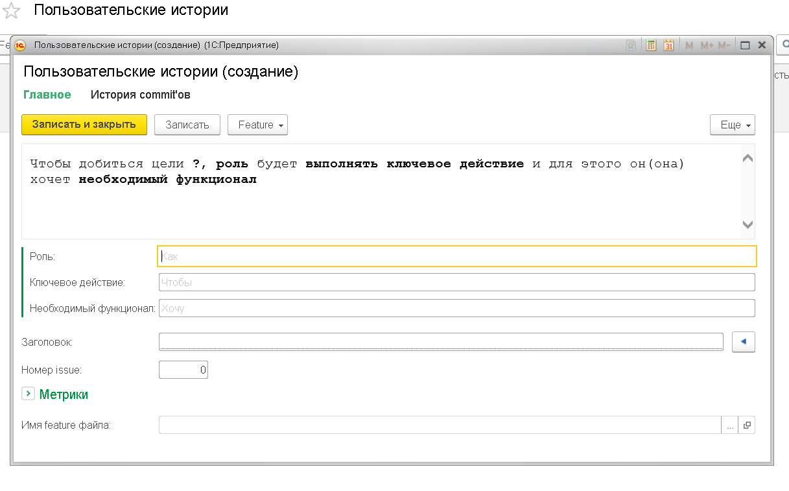

# АвтоАджайлер для команд разработки

обучающая конфигурация для руководителей центров компетенции 1С при имплементации Agile/Lean процессов в командах разработки

подготовливается в рамках:

* обучающих проектов SilverBulleters 
* доклада для Agile Kitchen - https://agilerussia.timepad.ru/event/336745/
* отладка облачного контура команды разработки 1С

основная цель конфигурации - обеспечить `Continious Product Learning` для команд разработки 1С

## Порядок коллективной разработки

* без Хранилища
* с CI-CD
* c проверкой качества
* через `git-flow`

## Лицензия

MPL 2.0

